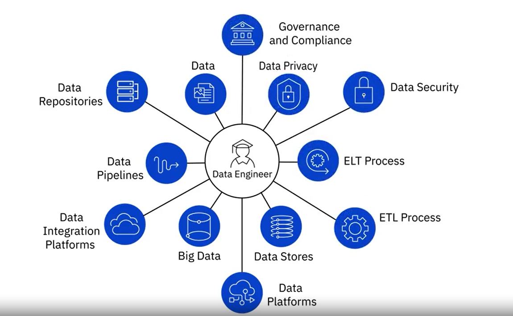

# WEEK 1

[Quiz 1 - ****Modern Data Ecosystem and role of Data Engineering****](./Quiz%201%20-%20Modern%20Data%20Ecosystem%20and%20role%20of%20Data.pdf)

[Quiz 2 - ****Responsibilities and Skillsets of a Data Engineer****](./Quiz%202%20-%20Responsibilities%20and%20Skillsets%20of%20a%20Data.pdf)

### ****Modern Data Ecosystem and role of Data Engineering****

Modern data ecosystem includes a network of interconnected and continually evolving entities that include:

- Data, that is available in a host of different formats, structures, and sources.
- Enterprise Data Environment, in which raw data is staged so it can be organized, cleaned, and optimized for use by end-users.
- End-users, such as business stakeholders, analysts, and programmers who consume data for various purposes.

Emerging technologies such as Cloud Computing, Machine Learning, and Big Data, are continually reshaping the data ecosystem and the possibilities it offers.

Data Engineers, Data Analysts, Data Scientists, Business Analysts, and Business Intelligence Analysts, all play a vital role in the ecosystem for deriving insights and business results from data.

The goal of Data Engineering is to make quality data available for analytics and decision-making. And it does this by collecting raw source data, processing data so it becomes usable, storing data, and making quality data available to users securely.

### ****Responsibilities and Skillsets of a Data Engineer****

The role of a Data Engineer includes:

- Gathering data from disparate sources.
- Integrating data into a unified view for data consumers.
- Preparing data for analytics and reporting.
- Managing data pipelines for a continuous flow of data from source to destination systems.
- Managing the complete infrastructure for the collection, processing, and storage of data.

To be successful in their role, Data Engineers need a mix of technical, functional, and soft skills.

- Technical Skills include working with different operating systems and infrastructure components such as virtual machines, networks, and application services. It also includes working with databases and data warehouses, data pipelines, ETL tools, big data processing tools, and languages for querying, manipulating, and processing data.
- An understanding of the potential application of data in business is an important skill for a data engineer. Other functional skills include the ability to convert business requirements into technical specifications, an understanding of the software development lifecycle, and the areas of data quality, privacy, security, and governance.
- Soft Skills include interpersonal skills, the ability to work collaboratively, teamwork, and effective communication.